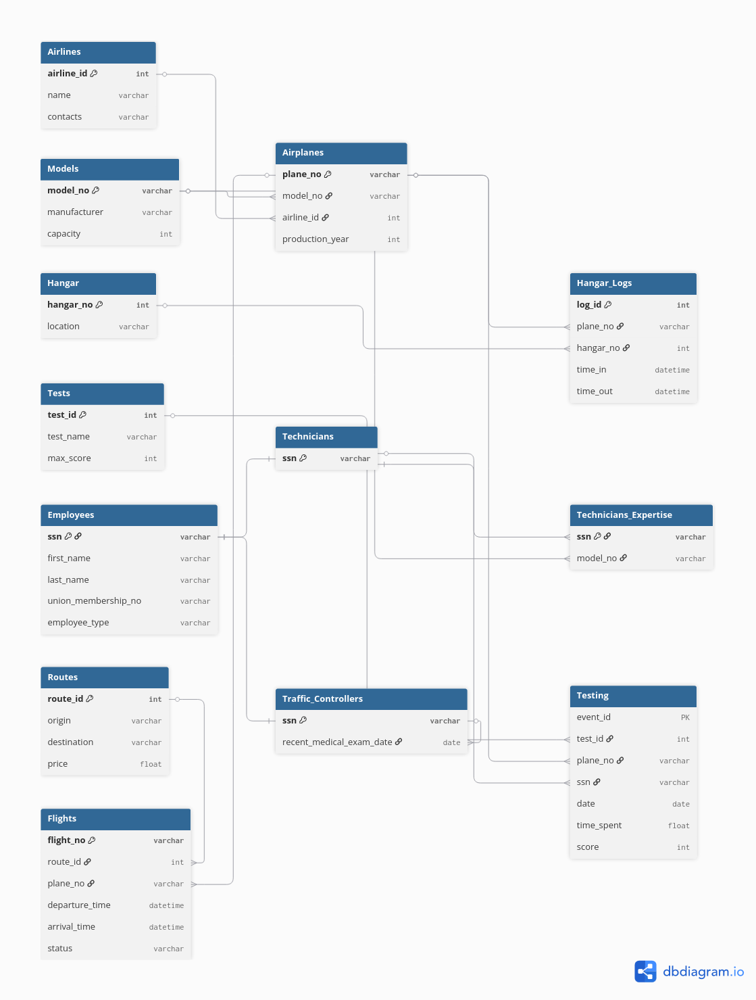

# ✈️ Ercan Airport Management System

## 📌 Introduction
This project is a Relational Database Management System 
(RDBMS) designed for Ercan Airport in Northern Cyprus. 
The goal of this database is to store, manage and retrieve 
all airport-related information in an organized and 
efficient manner.

## 📊 ER Diagram

## 📐 Relational Data Model
See [Relational Data Model](relational_model.md)

## 🗃️ Database Tables
| Table | Description |
|---|---|
| Airlines | Stores airline information |
| Models | Stores airplane model information |
| Hangar | Stores hangar locations |
| Tests | Stores airworthiness tests |
| Employees | Stores all airport employees |
| Routes | Stores flight routes and prices |
| Airplanes | Stores airplane details |
| Flights | Stores flight schedules |
| Technicians | Stores technician information |
| Traffic_Controllers | Stores controller information |
| Technicians_Expertise | Stores technician expertise |
| Hangar_Logs | Stores hangar entry/exit logs |
| Testing | Stores airplane test events |

## 🚀 How to Run
1. Run `DDL.sql` → creates all tables
2. Run `DML.sql` → inserts sample data
3. Run `queries.sql` → runs all 15 queries

## 🛠️ Built With
- MySQL
- dbdiagram.io
- draw.io

## 👤 Author
- Name: Abror Dodobaev
- Student No: 22408273
- Course: CMPE343